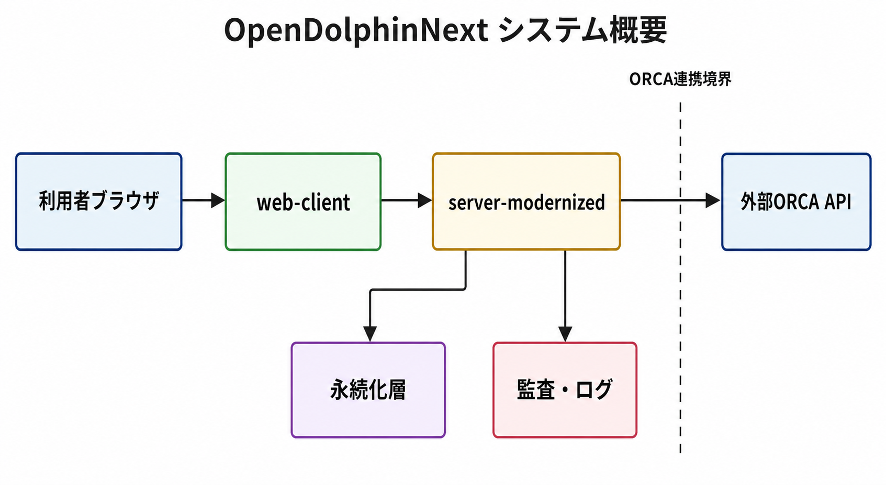
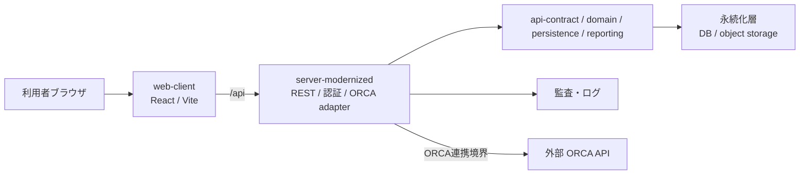

# アーキテクチャ

この文書は、OpenDolphinNext の現行構成をソースコード理解用に最小限で要約します。旧 Java クライアントと旧サーバー実装は現行構成として扱いません。

## web-client

- ブラウザ UI を提供します。
- ORCA へ直接接続せず、`server-modernized` の `/api` 入口だけを使います。
- 患者文脈は URL や browser storage を正本にしません。
- ORCA 状態表示は sanitized readiness を参照します。

## server-modernized

- REST resource、認証、認可、セッション、監査、ORCA 接続、添付、帳票の公開面を持ちます。
- 施設、利用者、患者、権限、ORCA 接続先などの権威情報を server 側で決定します。
- ORCA 接続は server 側設定から解決し、ブラウザから任意 URL を指定させません。

## 永続化層

- Maven module は `domain`、`api-contract`、`persistence`、`reporting`、`server-modernized` で構成されます。
- 主な永続化先は DB です。
- 添付、画像、帳票 binary は object storage を使う構成を想定します。
- storage URI、object key、digest、owner、facility をブラウザ権威にしません。

## ORCA連携境界

- ORCA / WebORCA は外部正本です。
- web-client から ORCA API を直接呼ばず、server 側 adapter を経由します。
- ORCA の warning、不一致、UNKNOWN は成功扱いにせず、監査・ログで追える状態にします。

図の補足説明は [system-overview.alt.md](assets/system-overview.alt.md) と [system-overview.mmd](assets/system-overview.mmd) にあります。
