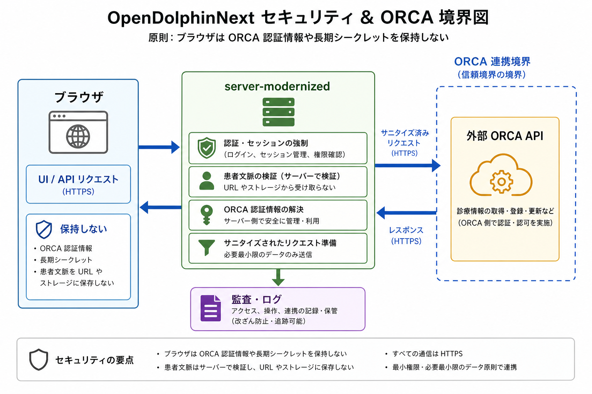

# セキュリティとORCA境界

この文書は、OpenDolphinNext のブラウザ境界と ORCA 連携境界を最小限で要約します。

## ブラウザに置かない情報

- ORCA 接続 URL、host、port、scheme
- ORCA Basic 認証値
- クライアント証明書、CA 証明書、証明書パスワード
- ORCA DB 接続情報
- 患者文脈の正本
- 認可判定の権威情報
- storage URI / object key / digest / facility / owner のような server authority

## ORCA認証情報

- ORCA 資格情報は server 側設定だけで扱います。
- readiness や audit に出すのは抽象化済み状態であり、実 URL や username/password ではありません。
- 接続先をブラウザ入力から任意に指定させません。

## 患者文脈

- 患者文脈は URL や browser storage を正本にしません。
- deep link query は入口専用で、処理後に scrub します。
- 患者 ID 単独や query 上の自由入力を Charts / Reception / Patients の authority にしません。

## sanitized readiness

- `GET /api/health` は liveness を返します。
- `GET /api/health/readiness` は sanitized readiness を返します。
- readiness は status、reasonCode、mode、credentialConfigured、clientAuthConfigured などの抽象化済み値に限定します。
- URL、host、port、raw exception、credential は返しません。

## 監査・ログ

- 監査は append-only を前提に扱います。
- raw ORCA body、credential、Cookie、CSRF、患者住所、保険詳細などをログや証跡へ混入させません。
- UNKNOWN、warning、不一致は成功に潰さず、追跡可能な状態として扱います。

## ORCA仕様参照

- [ORCA API Overview](https://www.orca.med.or.jp/receipt/users/tec/api/overview.html)

このリポジトリ内では ORCA 自体の詳細仕様を複写せず、公式ページを起点に current implementation の境界だけを説明します。

図の補足説明は [security-orca-boundary.alt.md](assets/security-orca-boundary.alt.md) と [security-orca-boundary.mmd](assets/security-orca-boundary.mmd) にあります。
