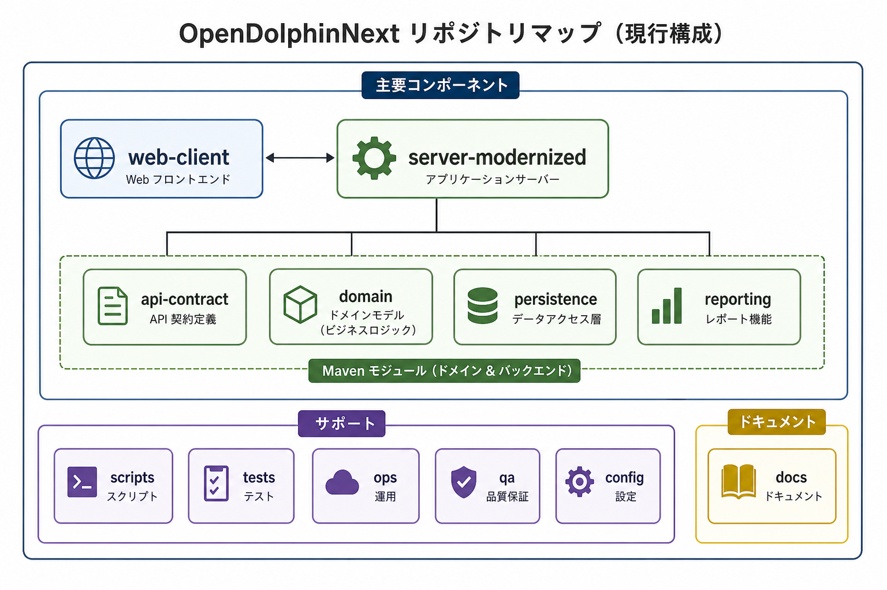

# ソース概要

このリポジトリの現行構成は `web-client/` と `server-modernized/` を中心にしています。

| パス | 役割 |
| --- | --- |
| `web-client/` | React / Vite ベースの現行 Web クライアント |
| `server-modernized/` | Jakarta EE 10 ベースの現行サーバー |
| `server-modernized/config/` | server-modernized の設定サンプルと静的解析設定 |
| `api-contract/` | 公開 DTO と API 契約の共有モジュール |
| `domain/` | ドメインモデル |
| `persistence/` | Entity、永続化、DB まわりの実装 |
| `reporting/` | 帳票と出力関連 |
| `scripts/` | CI 補助、検証、パッケージング用スクリプト |
| `tests/` | Playwright を含む repo-level テスト |
| `ops/` | Docker、ローカル起動、手動確認の補助資産 |
| `docs/` | 最小説明文書と保持対象の調査文書 |

`pom.server-modernized.xml` は `domain/`、`api-contract/`、`persistence/`、`reporting/`、`server-modernized/` をまとめてビルドします。

補足説明は [repository-map.alt.md](assets/repository-map.alt.md) と [repository-map.mmd](assets/repository-map.mmd) にあります。
